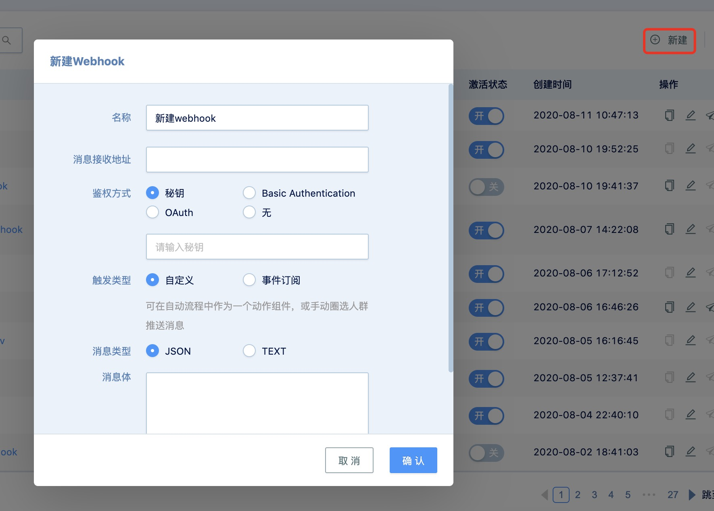

# Webhook管理

## Webhook简介
智慧营销平台提供了各种 Open API 供外部系统调用，但在某些情况下，可能需要智慧营销平台在合适的时刻能够主动推送消息给外部系统，例如在自动流程执行到特定步骤时，能推送消息给客户的各种终端系统。

Webhook 功能就是 智慧营销平台提供的消息推送机制，能够给在智慧营销平台台上注册过的接口推送消息。

比如，如果某个客户活跃度达到了 500 分，达到你公司的“高质量线索”标准，你就可以以“活跃度达到500分”为触发条件，使用智慧营销平台的 Webhook 功能，自动给你的 CRM 系统发送此通知，将该客户等级上调。


## 创建Webhook
点击 智慧营销平台 > 设置中心 > Webhook 进入Webhook列表页，点击右上角的 新建 按钮创建新的Webhook。


### 参数说明：

- 名称：给Webhook取一个有意义的名称，方便后续查看和更改。

- 消息接收地址：Webhook消息的接收地址。该地址必须是合法的完整地址，包含使用的协议（如 http 或 https）。

- 鉴权方式：为了防止非授信主体访问消息接收地址，消息接收地址的提供方需要提供一定的鉴权机制。智慧营销平台支持用以下鉴权机制来访问消息接收地址，具体内容参见 Webhook鉴权

- 秘钥：智慧营销平台在发送消息的时候会使用该密钥对消息内容进行签名，消息接收地址在接收到消息时进行验签，从而保证消息来源以及消息内容没有被篡改过。
- OAuth2：智慧营销平台发送消息时，使用OAuth2的客户端凭证方式（client crendentials）访问消息接收地址。
- 无：智慧营销平台发送消息时，不使用任何鉴权方式。
### 触发类型

- 自定义： 可在自动流程中作为一个动作组件，或手动圈选人群推送消息。选择此触发类型，需设置消息类型和消息体。
- 消息类型： 可选择以JSON或者文本格式发送消息。如果消息类型为JSON格式，则HTTP header中的Content-Type为application/json，如果为文本格式，则Content-Type为text/plain
- 消息体：可自定义消息内容，并可选择插入内容变量。智慧营销平台支持的内容变量有：客户属性，自定义对象属性、在用商品属性。如果是自动流触发的Webhook，还支持上下文事件属性。
- 事件订阅：指定事件发生后，该事件的内容会被发送给消息接收地址。智慧营销平台支持如下事件的订阅：客户事件、会员事件、客户属性变更、客户身份变更和营销活动属性变更。当订阅多个事件时，多个事件会分别逐条发送给消息接收地址，而不是一次性发送给消息接收地址。事件订阅的消息格式参见Webhook消息格式
- 自动重试：如果推送失败，会自动进行重试。自动重试开启后，智慧营销平台会最多重试3次：分别为发送后的30分钟，60分钟和90分钟。

## Webhook鉴权
### 基本认证
对于设置了基本身份认证的Webhook， 智慧营销平台向消息地址发送请求时，会在HTTP header中添加Authorization请求头。示例代码如下：
``` java
String content = username + ":" + password;
String token = "Basic " + Base64.getEncoder().encodeToString(content("utf-8"));
httpPost.setHeader("Authorization", token);
``` 
接收Webhook消息的服务可以用相同的方法验证请求的完整性。

### OAuth2
对于设置了OAuth2认证的 Webhook， 智慧营销平台首先会向token获取地址请求并获取access_token，然后携带access_token参数向消息接收地址发送消息。
- 获取token的方式如下：
``` java
GET https://{token获取地址}?appid={appid}&secret={secret}&grant_type=client_credentials
  ``` 
- 发送消息时的参数名为access_token，如：

 ``` java
POST https://{消息接收地址}
  ``` 
### 不使用任何鉴权方式
如果Webhook鉴权设置无，则不做任何鉴权，直接访问接受消息地址


